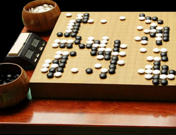
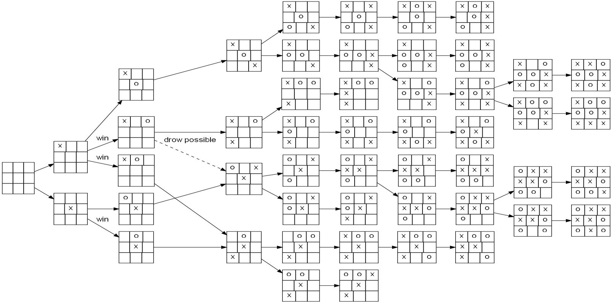
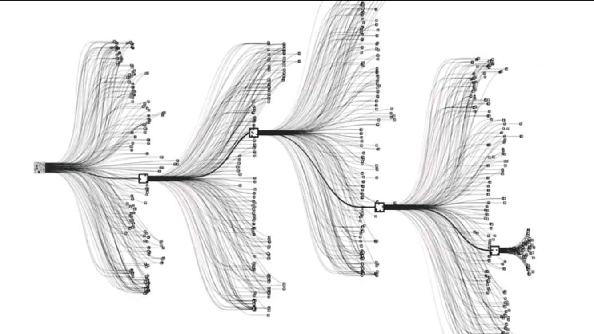
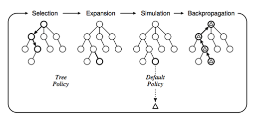
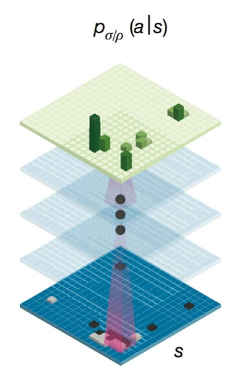
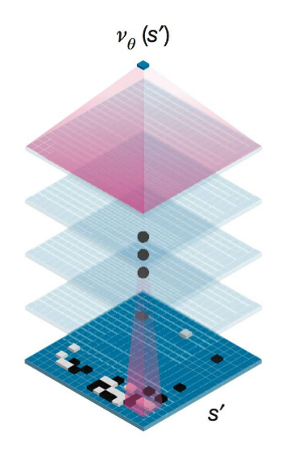

<script type="text/javascript"
    src="http://cdn.mathjax.org/mathjax/latest/MathJax.js?config=TeX-AMS-MML_HTMLorMML">
</script>

#  Le succès d'AlphaGo contre l'humain via Deep Learning
<br />
## Introduction
Le Go est un jeu de plateau ancient pour deux joueurs et depuis longtemps il est considéré comme le jeu le plus complex inventé par l'humain. Même après avoir vu le victoire de Deep Bleu contre le champion du monde dans l'échec, on ne pense toujours pas qu'un programme peut être capable de battre l'humain dans le Go.

Pourtant AlphaGo est arrivé. Créé par l'équipe DeepMind de Google, cette intelligence artificielle a réussi à battre un des meilleurs joueurs professionnels en 2016. Cet succès donne sans doute du crédit aux méthodes de Deep Learning employées dans son algorithme et donc ma veille consiste à découvrir pourqoui on a besoins de ces outils puissants et comment ils sont appliqués.

## Le Go, un jeu ancient et complex
### Qu'est-ce que c'est ?
Le Go est un jeu de plateau originaire de Chine avec plus de deux milles ans d'histoire. 

<div style="text-align:center" markdown="1">

</div>

En terme de règle :
>  Il oppose deux adversaires qui placent à tour de rôle des pierres, respectivement noires et blanches, sur les intersections d'un tablier quadrillé. Le but est de contrôler le plan de jeu en y construisant des « territoires ». Les pierres encerclées deviennent des « prisonniers », le gagnant étant le joueur ayant totalisé le plus de territoires et de prisonniers. - Wikipédia

Comparé avec l'échec, les règle du Go sont beaucoup plus simples. Pourtant le Go est toujours considéré comme un des jeux les plus complexes et personne n'a pu imaginer, avant la naissance d'AlphaGo, qu'un jour un programme peut battre l'humain dans ce jeu-là. Pourquoi ?

### La complexité du jeu
Bien que les règles du Go soient très simples, il est encore un jeu de très haute complexité. La mesure de la complexité d'un jeu peut être réalisée par l'estimation de la taille de son espace d'état. Espace d'état est l'ensemble d'états de jeu légaux et atteignables à partir de l'état initial du jeu. 

Pour le Go, le plateau est de taille 19x19, au total 361 positions, et chaque position peut être dans l'un des trois états : vide, noir ou blanc. Donc sa complexité sera 3^361.

Pour comparer, voici les complexités de quelques jeu connus dans le monde : 
 * Tic-tac-toe -  10^3
 * Echec - 10^47
 * Echec chinois - 10^40
 * Go - 10^170
 
Remarquez que l'estimation actuelle sur le nombre d'atom dans univers est de l'ordre de 10^82. Donc le Go a littéralement plus de numbre d'état que le nombre d'atom dans univers. C'est donc cet espace gigantesque qui donne au Go sa complexité énorme.


## Comment construire un algorithme de joueur ?
Le Go est un jeu à information parfaite. C'est-à-dire que toute information nécessaire pour prendre de la décision d'un tour est transparente et acccessible aux deux joueurs. Dans le cas du Go, cette information est uniquement l'état actuel du plateau. Donc, ce dernier est la seule donnée qu'on doit fournir en entrée, si on conçoit un algorithme qui joue au Go. Puis l'algorithme doit être capable de calculer en sortie une transformation à un autre état de plateau valable qui a une plus forte chance de gagner.

### Arbre de jeu
Comment ce calcul peut être réaliser ? L'idée est que si on prend l'état initial du jeu comme un noeud de racine et tous les états valables dans le tour prochain comme ses noeuds d'enfant et ainsi de suite, on peut construire un arbre qui contient tous les possibilités du jeu depuis le début jusqu'à la fin. 

<div style="text-align:center" markdown="1"  width="100%">

</div>

Un chemin depuis le noeud de racine à un noeud de feuille est alors un jeu complet. Donc, étant donné un état actuel de jeu, le calcul du programme peut être le parcours du sous-arbre partant de ce noeud actuel pour trouver un noeud d'enfant qui permet le plus de cas gagnants. Des algorithmes comme Min-Max sont en effet des réalisations concrètes de cette idée-là.

Cependant, cette approche est problématique voire même irréalisable pour le Go. 

### Problème critique pour le Go
Comme on a présenté précédemment, le Go a une complexité énorme, ce qui conduit à un arbre de jeu aussi gigantesque dont chaque noeud a en moyenne 200 noeuds d'enfant.   

<div style="text-align:center" markdown="1">

</div>

Donc bien que le parcours de l'arbre soit la solution génerale pour un tel programme de joueur, il n'est technique pas réalisable de faire le parcours total de cet arbre comme ce qu'on fait dans l'algorithme minimax. 

C'est aussi le cas pour d'autres jeux comme l'échec, qui a aussi un espace d'état trops large à parcourir. Pourtant, l'humain a pu écrire une fonction heuristique pour évaluer le plateau d'échec à un état donné. En utilisant une telle fonction, on peut estimer le meilleur mouvement qui a la plus forte chance à gagner sans besoin de faire trops de parcours de l'espace. C'est la méthode implémentée dans le Deep Blue, superordinateur qui a battu le champion du monde d'échecs en 1996.

Malheureusement, cette approche ne marchera pas pour le Go parce que les spécialistes n'arrivent toujours pas à trouver une telle fonction avec performance acceptable. Il faut nécessairement retourne vers une recherche partielle de l'arbre de jeu.

Donc pour développer une intelligence artificielle qui peut jouer au Go, dans le cas où la recherche totale de l'arbre n'est pas faisable, il faut résoudre quelques problèmes critiques : 

    1. Comment évaluer la probabilité de gagner à chaque position ?
    2. Comment réduire la recherche ?

## Approche avant AlphaGo - Recherche arborescente Monte-Carlo
La recherche arborescente Monte-Carlo est un algorithme heuristique qui répond au premier problème. Il va estimer la probabilité de gagner d'un état du jeu de manière purement probabiliste. En plus, il ne nécessite quasiment pas de connaissance sur le jeu.

<div style="text-align:center" markdown="1"  width="100%">

</div>

Soit on est maintenant à état de départ s0 du jeu qui est en effet un plateau vide. A priori on a 361 choix possibles pour l'état suivant s1. Le programme commence la simulation en supposant que tous les choix sont équiprobable en terme de gagner. Donc il va choisir aléatoirement un positionnement de pière p0 pour transformer l'état à s1 parmi les 361. Puis dans son simulation, il suppose que son adversaire prend des décisions de la même manière que lui, donc encore un choix aléatoire équiprobable p1 pour aller à s2, ainsi de suite. A la fin, si le programme gagne, ça veut dire que les décisions (si,pi) pendant cette simulation marchent bien et alors on doit les donner une évaluation meilleure que les autres.

Donc si initialement les choix ont tous un score de 1, maintenant on doit mettre à jour les scores à partir du résultat de simulation de la manière que 

```
Score = Score_initial + résultat
Score_initial = 1 pour tous
Résultat = numbre de simulation gagnée
```
Puis on commence une nouvelle simulation, mais à la suite on choisit parmis les choix selon leurs scores. Donc dès le deuxième tour, les choix qui ont permis à gagner auront plus de chance d'être choisis. Donc en continuant à faire des simulations de jeu, les scores des choix prometteurs augmenteront et ils auront plus de chance d'être évalués dans les simulations. A la fin, le programme va choisir celui dont le score est le plus élevé pour son vrai tour.

La performance de cet algorithme est montré assez satisfaisante. Grâce à lui, le programme CrazyStone était le plus puissance à l'époque parmi tous les logiciel de joueur de Go. Mais il est toujours loin du niveau humain parce que la performance est limitée par sa faible éfficacité : un grand nombre de simulations sont inutiles à cause des décisions purement aléatoire. On revient au deuxième problème posé précédemment.

## Amélioration par introduction de Deep Learning
La solution que l'équipe DeepMind propose dans AlphaGo est d'introduire deux réseaux de neurones à convolution qui permettra une recherche plus éfficace de l'arbre dans la méthode Monte-Carlo.

### Policy Network
<div style="text-align:center" markdown="1"  width="100%">

</div>
Le policy network est un réseau à convolution de 13 layers vise à imiter le comportement humain face à un état du jeu. Il prend en entrée état s0 du jeu et en sortie une estimation de la distribution de probabilité des positionnements pi avec un classifieur softmax.

Les données d'apprentissage sont les paires de état-positionnement (s,p) retirées depuis le site [KGS](https://www.gokgs.com/), une plateforme de match en ligne de Go. Donc on entraîne le réseau tel qu'il prédit les positionnements de pière les plus probables pour un joueur humain face à l'état du plateau. Pendant le test, ce réseau arrive à un taux de succès de prédiction de 55.7%.

En remplaçant la prise de choix aléatoire au début des simulations de recherche Monte-Carlo par la sortie de ce réseau, on calcule les scores de chaque choix de la manière : 
```
Score = Score_initial + proba_de_gagne_simulation
Score_initial = proba_policy_network / (numbre_de_foi_être_choisi + 1)
```
Donc au début on choisit selon la distribution de probabilité donnée par le policy network. Au fur à musure des simulation, le choix sera basé plus sur les résultats de simulation que la sortie du réseau. Donc on gagne beaucoup d'éfficacité en ne plus faire des choix aléatoires équiprobales. On a en effet augmenté l'éfficacité de la recherche en largeur de l'arbre. 

### Value Network
<div style="text-align:center" markdown="1"  width="100%">

</div>
Si on considère que le policy network comme une réduction de recherche en largeur, le value network sert alors à une réduction de recherche en profondeur.

Simuler un jeu jusqu'à la fin pour savoir qui gagne et qui pert est toujours une opération très lourde à faire. Donc on se demande si on peut trouver une façon de prédire si on va gagner le jeu étant donné l'état associé. Si c'est possible, on n'a plus besoin d'aller jusqu'au dernier tour du jeu dans les simulations, ce qui économisera encore plus de temps. C'est le but d'avoir le value network. 

Ce réseau est entraîné via regression avec cette fois les données sous forme de paire état-résultat du jeu (s,r) pour qu'en donnant un état du jeu, la sortie est une valeur réel interprétée comme la probabilité de gagner. Donc quand on atteint un certain niveau de profondeur, le programme applique directement le value network pour avoir le résultat. Et les scores seront mis à jour de la manière : 
```
Score = Score_initial + 0.5*proba_de_gagne_simulation + 0.5*évaluation
Score_initial = proba_policy_network / (numbre_de_foi_être_choisi + 1)
```
Pour un noeud de feille, évaluation est la sortie du value network et pour un noeud parent, elle est la moyenne des évaluations de ses noeud d'enfant directs. Les facteurs 0.5 sont les valeurs optimisées d'après l'équipe DeepMind.

### Auto-évolution du réseau

L'idée du value network est intéressante mais son entraînement nécessite beaucoup plus de données que DeepMind a pu retirer depuis KGS. Si on ne trouve pas une méthode qui nous donne beaucoup plus de données du jeu, ce réseau ne sera jamais existé. Heureusement, comme la version sans value network d'AlphaGo est déjà capable de jouer, on peut créer par soi-même des données en mettant deux copies d'AlphaGo comme adversaires. En plus, les jeux entre deux programmes se passent très vite et ils n'ont pas besoin de se reposer. L'équipe a pu générer environs 30 millions de jeux par cette méthode et la version entraînée avec ces données a 80% taux de gagner entre la version sans cet entraînement.

## Conclusion

La recherche arborescente Monte-Carlo combinant deux réseaux de neurones plus des données d'apprentissage massives, c'est le principal mécanisme derrière AlphaGo. Mais ce ne sera pas que cela. AlphaGo est encore en train d'évoluer même depuis son succès contre Lee Sedol, le joueur professionnel coréen, en mars 2016.

Au début janvier 2017, DeepMind a lancé anonymement une version avancée d'AlphaGo développée pendant l'année 2016 sur sur les plateformes Tygem et FoxGo pour jouer contre les internautes. Ses succès a pu intéresser rapidement les meilleurs joueurs du monde à participer. Au moment où DeepMind a relevé la vraie identité de ce compte joué par AlphaGo, il a déjà eu 60 jeux gagnés de manière successive.

Donc si on pense que pendant son compétition contre Lee Sedol, le seul jeu perdu montre que AlphaGo était au même niveau que l'humain, maintenant il a peut-être déjà largement dépassé.

## Bibliographie

1. [Wikipedia - AlphaGo](https://en.wikipedia.org/wiki/AlphaGo)
2. [Masteringthe Game of Go with Deep Neural Networks and Tree Search](https://gogameguru.com/i/2016/03/deepmind-mastering-go.pdf)
3. [Move Evaluation in Go Using Deep Convolutional Neural Networks](https://arxiv.org/abs/1412.6564)
4. [Discussion sur Reddit](https://www.reddit.com/r/MachineLearning/comments/4a7lc4/alphago_vs_deep_blue/?st=j05jdcg6&sh=61793145)
5. [[Computing Space VIII] Games Cartographers Play: Alphago, Neural Networks and Tobler’s First Law](https://blogs.loc.gov/maps/category/game-theory/)
